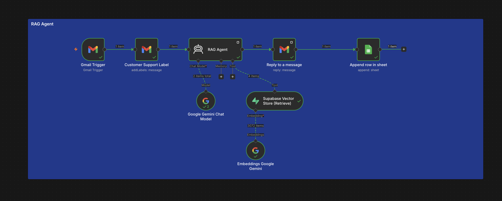
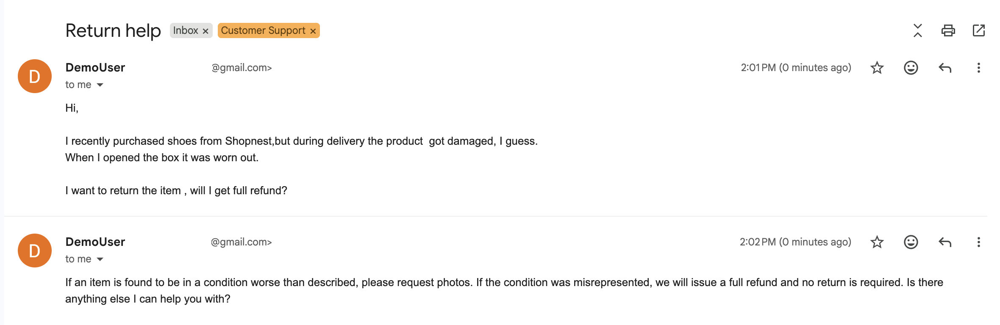
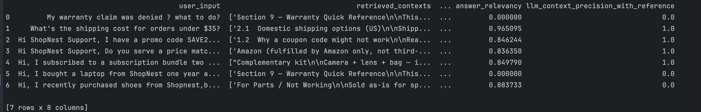

# RAG Support Agent — RAGAS Evaluation


## 📌 Overview
RAGAS evaluation of an n8n-based RAG support agent. The agent reads customer support emails, retrieves relevant chunks from a Supabase vector store, and generates a reply using Google Gemini.

Real question/context/answer data was captured from live agent runs, paired with hand-written expected answers, and scored against four RAGAS metrics using Claude as the judge model.

## 🖼️ Screenshots





## 🔄 Workflow

Data capture: Gmail Trigger → RAG Agent (retrieval + generation) → Reply → Append Row in Sheet (question, context, answer).

Evaluation: Export sheet as CSV → merge in expected answers → run RAGAS metrics (Claude as judge) → results CSV.

## 📁 Project Structure

```

rag-support-agent-ragas-eval

├── README.md
├── eval_ragas.py
├── load_test_data.py
├── reference.py
├── show_results.py
├── ragas_test_data.csv
├── ragas_results.csv
├── workflow/
│   └── rag-agent.json
└── screenshots/
    ├── workflow-canvas.png
    ├── sample-email.png
    └── results-output.png

```

## 🎯 Metrics Used

| Metric | Stage | What it checks |
|---|---|---|
| Context Recall | Retrieval | Did retrieval find everything needed to answer correctly? |
| Context Precision | Retrieval | Of what was retrieved, how much was actually relevant? |
| Faithfulness | Generation | Does the answer only make claims supported by the retrieved context? |
| Answer Relevancy | Generation | Does the answer address the question asked? |

## 📊 Test Set

7 real customer support questions, sent live through the Gmail-triggered n8n RAG Agent and captured automatically. Covers shipping cost, promo codes, price matching, bundle returns, damaged item refunds, and two phrasings of a warranty claim question.

## 🛠️ Tools Used

- n8n (source RAG agent — Gmail, Supabase Vector Store, Google Gemini)
- RAGAS
- Claude (`claude-haiku-4-5-20251001`) as judge model
- pandas

## 🔧 Setup

Requires Python 3.12+, an Anthropic API key, and the source n8n RAG agent already running with data captured to a Google Sheet.

```bash
python3 -m venv venv
source venv/bin/activate
pip install -r requirements.txt
```


🚧 Known Limitation

Retrieval fails on warranty-related questions despite the correct answer existing in the database.

## 👩‍💻 Author
Swati J
